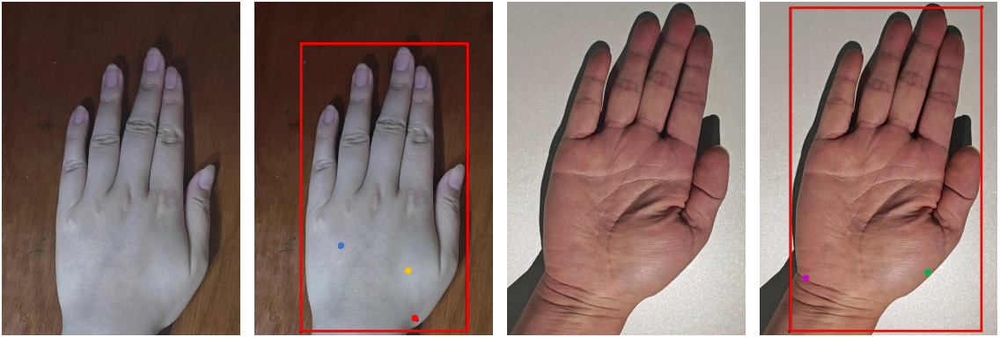

# Hand_acupuncture_points_dataset

The dataset includes 814 palm images and 903 dorsum images. Hand videos were collected by recruiting volunteers of different age groups, 
and the original hand images were obtained through frame-by-frame sampling and image selection. Following the COCO dataset labeling format, 
professional physicians were then invited to annotate the acupoints on the pictures. The palm images are labeled with three acupoints: 
Yuji (LU10), Shenmen (HT7), and Zhongzhu (TE3); the dorsum images are labeled with two acupoints: Hegu (LI4) and Yangxi (LI5).

